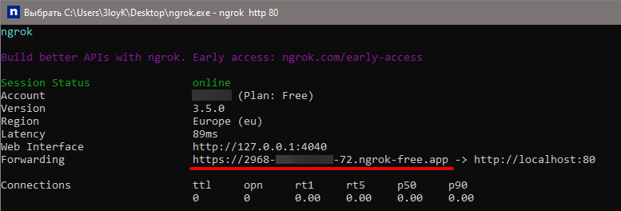
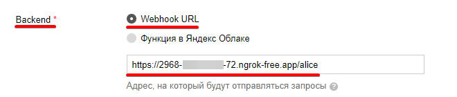

# Подключение локального вебхука

## Ngrok

Чтобы провести первый запуск, нужно подключить вебхук к Диалогам. \
Его можно сделать через [ngrok](https://ngrok.com/){:target="_blank"} - это сервис, который позволяет сделать локальный порт доступным из интернета без настройки NAT, роутера, DDNS и других протоколов.
Программа создаёт туннель между вашим компьютером и удалённым сервером и предоставляет доступ к нему с уникального домена.

1. [Установите](https://dashboard.ngrok.com/get-started/setup){:target="_blank"}, разархивируйте и запустите ngrok.

2. Добавьте ваш [auth-token](https://dashboard.ngrok.com/get-started/your-authtoken){:target="_blank"} в консоль ngrok'а.
    ```bash
    ngrok config add-authtoken <your-token-here>
    ```

3. Запустите ngrok
    ```bash
    ngrok http 80
    ```

4. Через пару секунд появится длинная ссылка. Её надо указать как вебхук юрл и добавить **/alice** после ссылки:

    !!! warning "Важно"
        Не выключайте ngrok, иначе туннель закроется.

    

    

5. Сохраните изменения внизу страницы.

    


!!! note "Примечание"
    Для запуска в прод вам нужен свой домен и [SSL сертификат](https://wiki.yaboard.com/s/zc){:target="_blank"},
    об этом подробнее в [официальной документации](https://yandex.ru/dev/dialogs/alice/doc/deploy-overview.html){:target="_blank"}.


## [Код](https://github.com/K1rL3s/aliceio/blob/master/examples/fast_start.py){:target="_blank"}

> Если вы ещё не установили библиотеку, то это можно сделать так:
> ```bash
> pip install -U aliceio
> ```
> Или:
> ```bash
> python -m pip install -U aliceio
> ```

Самый простой навык, который умеет только приветствовать пользователя. \
Скопируйте его, укажите айди вашего навыка и запустите скрипт.

```python
from aiohttp import web
from aliceio import Dispatcher, Skill
from aliceio.types import Message
from aliceio.webhook.aiohttp_server import OneSkillAiohttpRequestHandler, setup_application

dp = Dispatcher()
skill = Skill(skill_id="...")  # Вставьте сюда айди навыка

@dp.message()
async def hello(message: Message) -> str:
    return f"Привет, {message.session.application.application_id}!"

def main() -> None:
    app = web.Application()
    requests_handler = OneSkillAiohttpRequestHandler(dispatcher=dp, skill=skill)

    WEB_SERVER_HOST = "127.0.0.1"
    WEB_SERVER_PORT = 80
    WEBHOOK_PATH = "/alice"

    requests_handler.register(app, path=WEBHOOK_PATH)
    setup_application(app, dp, skill=skill)
    web.run_app(app, host=WEB_SERVER_HOST, port=WEB_SERVER_PORT)

if __name__ == "__main__":
    main()
```

## Тестирование

Перейдите на вкладку **Тестирование** и проверьте работу вашего навыка:


