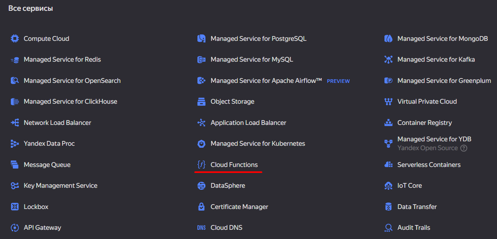

# Подключение облачной функции Яндекса

## [Создайте функцию](https://yandex.ru/dev/dialogs/alice/doc/ru/quickstart-programming#prepare-code)

Чтобы провести первый запуск, нужно подключить облачную функцию Яндекса к Диалогам.

1. Перейдите по [ссылке](https://console.cloud.yandex.ru/). Примите условия и нажмите кнопку Войти.

2. Введите название нового облака и нажмите кнопку Создать.

3. Если у вас нет платежного аккаунта, [зарегистрируйте](https://cloud.yandex.ru/docs/billing/quickstart/index) его. \
    Платежный аккаунт необходим для любых сервисов Yandex Cloud, даже бесплатных. \
    Функции Cloud Functions для навыков Алисы не тарифицируются — Yandex Cloud не будет списывать деньги с вашей карты.

4. Откройте [консоль управления](https://console.cloud.yandex.ru/).

5. Выберите **Cloud Functions**.

    

6. Нажмите кнопку **Создать функцию**.

    

7. Введите имя функции. Условия:
    - длина — от 3 до 63 символов;
    - может содержать строчные буквы латинского алфавита, цифры и дефисы;
    - первый символ — буква, последний — не дефис.
    - Например, `my-first-function`.

8. Нажмите кнопку **Создать**.

    

9. Выберите **Python** и нажмите кнопку **Продолжить**.

    


## [Создайте версию функции](https://yandex.ru/dev/dialogs/alice/doc/ru/quickstart-programming#create)

Каждая версия функции — это исходный код на языке программирования.

1. Откройте созданный файл `index.py`:

    

2. Скопируйте [код](https://github.com/K1rL3s/aliceio/blob/master/examples/yandex_functions.py){:target="_blank"} и вставьте его вместо функции `handler`

    ```python
    from typing import Any

    from aliceio import Dispatcher, Skill
    from aliceio.types import AliceResponse, Message, Response
    from aliceio.webhook.yandex_functions import (
        OneSkillYandexFunctionsRequestHandler,
        RuntimeContext,
    )

    dp = Dispatcher()
    skill = Skill(skill_id="...")  # Вставьте айди навыка
    requests_handler = OneSkillYandexFunctionsRequestHandler(dp, skill)

    @dp.message()
    async def message_handler(
        message: Message,
        ycf_context: RuntimeContext,
    ) -> AliceResponse:
        text = "Привет!" if message.session.new else message.original_utterance
        text += (
            "\n\nПеред отправкой у меня осталось "
            f"{ycf_context.get_remaining_time_in_millis()} миллисекунд"
        )
        return AliceResponse(response=Response(text=text))

    # Нужно поставить эту функцию как точку входа
    async def main(event: dict[str, Any], context: RuntimeContext) -> Any:
        return await requests_handler(event, context)
        # аналогично:
        # return await requests_handler.handle(event, context)
    ```

    

3. Создайте файл `requirements.txt` и добавьте туда **aliceio**:

    

    

    

4. Измените точку входа на `index.main`:

    

5. Сохраните изменения в конце страницы:

    

    


## Подключите функцию к Диалогам

В настройках навыка выберите **Backend** -> Функция в Яндекс Облаке -> `accountname/cloudname/funcname`


## Тестирование

Перейдите на вкладку **Тестирование** и проверьте работу вашего навыка:


!!! info "Дополнительные возможности"
    При использовании облачных функций Яндекса у вас появляется возможность
    обратиться к контексту вызова по ключу `ycf_context` в мидлварях и хэндлерах.

    https://yandex.cloud/ru/docs/functions/concepts/runtime/execution-context
    https://yandex.cloud/ru/docs/functions/lang/python/context
