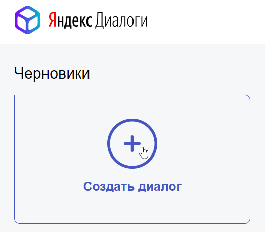
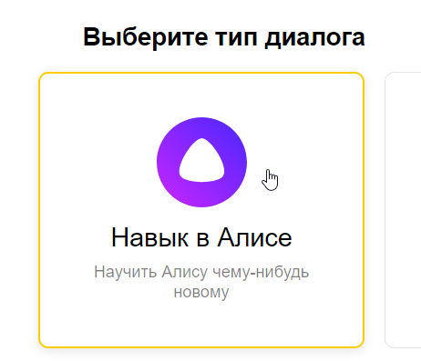
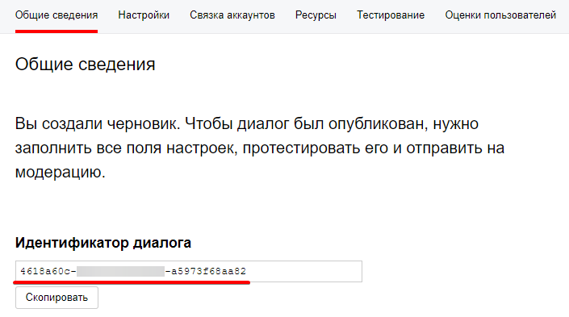
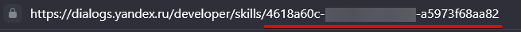

# Создание навыка

Чтобы интерактивно взаимодействовать с будущими примерами работы фреймворка, необходимо создать тестовый навык в Алисе.

### [Создание навыка](https://yandex.ru/dev/dialogs/alice/doc/skill-create-console.html){:target="_blank"}

1. Зарегистрируйтесь в Яндексе или залогиньтесь, если вы уже зарегистрированы.

2. Перейдите в [панель разработчика](https://dialogs.yandex.ru/developer/){:target="_blank"}.

3. Нажмите **Cоздать диалог**:

    

4. Выберите **Навык в Алисе**:

    

5. Заполните все поля со звёздочкой, кроме поля **Backend**.

### Айди навыка

Он понадобится нам совсем скоро. \
Его можно найти на вкладке **Общие сведения** в панели разработчика:

Или в ссылке в поисковой строке:

### Вы великолепны!

Теперь подключите [вебхук](connect-webhook.md) или [облачную функцию](connect-yandex-functions.md) по вашему желанию
