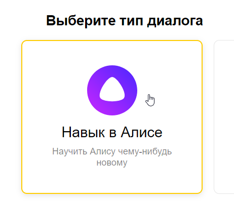

# Настройка навыка

Чтобы интерактивно взаимодействовать с будущими примерами работы фреймворка, необходимо создать тестовый навык в Алисе.

## [Создание](https://yandex.ru/dev/dialogs/alice/doc/skill-create-console.html)

1. Зарегистрируйтесь в Яндексе или залогиньтесь, если вы уже зарегистрированы.
2. Перейдите в [панель разработчика](https://dialogs.yandex.ru/developer/).
3. Нажмите **Cоздать диалог**.

    

4. Выберите **Навык в Алисе**

    

5. Заполните поля и выберите **Webhook URL** в поле **Backend**
    (рекомендуем использовать [ngrok](https://ngrok.com/))

    

6. Сохраните изменения внизу страницы.

    

7. Перейдите на вкладку **Тестирование** для проверки работы вашего навыка.

    


!!! note "Примечание"
    Для запуска в прод вам нужен свой домен и SSL сертификат, об этом подробнее в [официальной документации](https://yandex.ru/dev/dialogs/alice/doc/deploy-overview.html).


## Пример

Самый простой навык, который умеет только приветствовать пользователя.

Скопируйте его, укажите `skill_id` и запустите скрипт. Обновите вкладку **Тестирование** и наблюдайте результат.

```python
from aiohttp import web
from aliceio import Dispatcher, Skill
from aliceio.types import Message
from aliceio.webhook.aiohttp_server import OneSkillRequestHandler, setup_application

dp = Dispatcher()
skill = Skill(skill_id="...")

@dp.message()
async def hello(message: Message) -> str:
    return f"Привет, {message.session.application.application_id}!"

def main() -> None:
    app = web.Application()
    webhook_requests_handler = OneSkillRequestHandler(dispatcher=dp, skill=skill)

    WEB_SERVER_HOST = "127.0.0.1"
    WEB_SERVER_PORT = 80
    WEBHOOK_PATH = "/alice"

    webhook_requests_handler.register(app, path=WEBHOOK_PATH)
    setup_application(app, dp, skill=skill)
    web.run_app(app, host=WEB_SERVER_HOST, port=WEB_SERVER_PORT)

if __name__ == "__main__":
    main()
```
